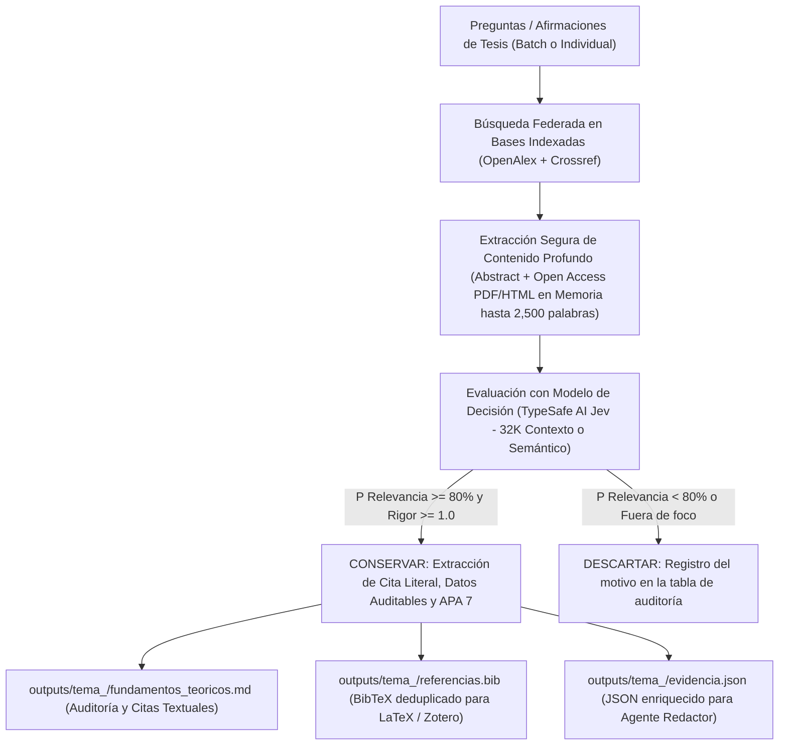

# 🎓 Thesis Consensus: Buscador y Evaluador Científico para Fundamentos Teóricos de Tesis

**Thesis Consensus** es un sistema automatizado en Python diseñado específicamente para tesistas de pregrado y posgrado. Su propósito es **fundamentar con rigor científico afirmaciones y preguntas de investigación**, contrastando la literatura mediante **modelos de decisión (TypeSafe AI Jev con 32K de contexto / Unsloth Laya / Evaluador Semántico de Facetas)**, aplicando un **umbral exigente (80% - 85%)** y extrayendo evidencias empíricas auditables y bibliografía bajo las normas oficiales **APA 7ma Edición**.

Inspirado en plataformas como *Consensus.app*, pero adaptado a la elaboración sistemática del marco teórico y fundamentación teórica de una tesis universitaria.

---

## 📑 Tabla de Contenidos

- [1. Arquitectura y Flujo de Trabajo](#1-arquitectura-y-flujo-de-trabajo)
- [2. ¿Qué se le envía al Modelo de Decisión? (Resumen vs. Contenido Completo y Ventana de 32K)](#2-qué-se-le-envía-al-modelo-de-decisión-resumen-vs-contenido-completo-y-ventana-de-32k)
- [3. Mecanismos de Validación y Modelos de Decisión](#3-mecanismos-de-validación-y-modelos-de-decisión)
- [4. Seguridad y Cero Riesgo de Malware](#4-seguridad-y-cero-riesgo-de-malware)
- [5. Auditoría Científica, Cero Alucinación y Estándar APA 7ma Edición](#5-auditoría-científica-cero-alucinación-y-estándar-apa-7ma-edición)
- [6. evidencia.json: API Estructurada para Agentes Redactores](#6-evidenciajson-api-estructurada-para-agentes-redactores)
- [7. Configuración Centralizada (constants.py y .env)](#7-configuración-centralizada-constantspy-y-env)
- [8. Modos de Uso y Ejecución por Lote (Batch)](#8-modos-de-uso-y-ejecución-por-lote-batch)
- [9. Organización Estructurada de Salidas (outputs/)](#9-organización-estructurada-de-salidas-outputs)
- [10. Tipado Estricto (Cero Any) y Pruebas Unitarias](#10-tipado-estricto-cero-any-y-pruebas-unitarias)

---

## 1. Arquitectura y Flujo de Trabajo

El sistema opera bajo un pipeline secuencial de 5 fases para garantizar que ningún texto quede sin sustento científico:



---

## 2. ¿Qué se le envía al Modelo de Decisión? (Resumen vs. Contenido Completo y Ventana de 32K)

Una duda fundamental en la investigación asistida por IA es: **¿Es suficiente evaluar el resumen o se debe enviar el contenido completo del artículo (HTML / PDF)?**

### La Limitación de los Modelos Locales y la Ventaja de TypeSafe Jev (32K Tokens):
1. **Límite de Contexto en Modelos Locales:**
   - Modelos pequeños de decisión como *Unsloth Laya* tienen ventanas de contexto de **512 a 1024 tokens**.
   - Enviar un artículo completo o múltiples secciones saturaba el contexto de inmediato, causando truncamiento forzado o fallas de memoria.
2. **Capacidad Ampliada con TypeSafe AI Jev (32,768 tokens):**
   - El motor principal por defecto es **TypeSafe AI Jev (`jev-latest`)**, un modelo especializado de decisión System One con una ventana masiva de **32K tokens**.
   - Esto permite enviar secciones sustanciales de artículos: el abstract completo más extractos extensos de **Resultados (Results/Findings)**, **Metodología** y **Conclusiones** (hasta 2,500 palabras / 18,000 caracteres por artículo), permitiendo al modelo evaluar la evidencia empírica real.
3. **Paywalls y Acceso Abierto:**
   - Cuando un artículo tiene muro de pago (*paywall*), se evalúan sus metadatos científicos oficiales y el resumen estructurado indexado por OpenAlex/Crossref.
   - Cuando el artículo es de **Acceso Abierto (Open Access)**, el extractor descarga el PDF o HTML en memoria y procesa las secciones de resultados para someterlas a evaluación del modelo.

### Estructura de Entrada al Modelo de Decisión:
```
Paper Title: [Título del artículo]
Venue/Journal: [Revista o Congreso indexado]
Year: [Año de publicación]
Content Source: open_access_pdf | open_access_html | abstract_only
Content/Findings Excerpt:
[Párrafos con resultados empíricos, métricas de tickets, cuellos de botella, metodologías o conclusiones teóricas]
```

---

## 3. Mecanismos de Validación y Modelos de Decisión

El sistema soporta tres motores de evaluación:

### A. TypeSafe AI Jev (Predeterminado - Motor Principal)
- **Tecnología:** Modelo de evaluación System One de TypeSafe AI (`https://api.typesafe.ai/v1/systemone`) optimizado para decisiones estructuradas de software e investigación.
- **Capacidad:** 32,768 tokens de contexto.
- **Consultas ejecutadas en paralelo por paper:**
  1. `is_relevant` (`noul`): Calibra la probabilidad matemática de pertinencia directa con la pregunta de tesis (criterios estrictos true/false).
  2. `evidence_type` (`choice`): Clasifica en `case_study`, `survey_or_data`, `theoretical` o `irrelevant`.
  3. `rigor_score` (`score`): Calibra la rigurosidad científica en una escala de 0.0 a 3.0 (`insufficient`, `acceptable`, `solid`, `authoritative`).

### B. Unsloth Laya (Modelo Local Alternativo)
- Modelo de decisión neuronal local ejecutado en GPU vía Unsloth Desktop (`http://localhost:8888/v1/systemone`). Contexto de 512-1024 tokens.

### C. Evaluador Semántico por Facetas Académicas (Fallback Autónomo sin API)
- Algoritmo determinístico calibrado que verifica la presencia y congruencia de los 3 pilares indispensables de la tesis (marco metodológico, contexto universitario y problemática operativa). Se activa automáticamente si no hay conexión de red o API key configurada.

### D. Umbral Estricto de Corte (80% - 85%)
- **Regla:** Solo se conserva un artículo si su probabilidad calculada es **mayor o igual al 80% (o al 85% en modo estricto)** y su rigor metodológico es de al menos 1.0 (calidad académica aceptable o superior).
- Artículos con baja correlación temática o metodología insuficiente se descartan de forma automática, dejando constancia del motivo.

### E. Glosario de Etiquetas y Tipologías en los Reportes

#### 1. Motores de Decisión (`Motor de Decisión`)
- **`typesafe_jev`:** Modelo System One de TypeSafe AI con 32K tokens de contexto.
- **`unsloth_laya`:** Modelo de decisión local Unsloth Laya en GPU (512-1024 tokens).
- **`heuristic_academic`:** Evaluador semántico por facetas académicas (autónomo / sin API).

#### 2. Tipologías de Evidencia (`Tipo de Evidencia`)
- **`theoretical` (Marco Teórico / Conceptual):** Artículos dedicados a fundamentos teóricos, normas formales, principios de marcos de trabajo (ITIL v3/4, COBIT, ISO/IEC 20000) o revisiones sistemáticas de literatura.
- **`case_study` (Estudio de Caso Real):** Investigaciones que documentan la aplicación práctica de ITSM, Help Desk o gestión de incidentes en universidades, facultades o centros educativos específicos.
- **`survey_or_data` (Estudio Cuantitativo / Métricas):** Artículos basados en encuestas estadísticas, análisis cuantitativo de volúmenes de tickets, cuellos de botella, tiempos de respuesta (MTTR) o acuerdos de nivel de servicio (SLA).
- **`irrelevant` (No Relevante):** Documentos descartados por pertenecer a otros dominios o no aportar a las preguntas de investigación.

---

## 4. Seguridad y Cero Riesgo de Malware

Descargar y ejecutar archivos PDF arbitrarios de internet representa vectores de ataque conocidos (exploits de Adobe/PDF, macros incrustadas o scripts maliciosos). Thesis Consensus garantiza **100% de inmunidad**:

1. **Sin Almacenamiento en Disco de Binarios:** No se crea ningún archivo binario ejecutable ni archivo `.pdf` temporal en tu sistema de archivos.
2. **Procesamiento Estrictamente en Memoria:** Las solicitudes a PDFs abiertos se descargan como un flujo de bytes en `io.BytesIO` y son leídas por el analizador en memoria `pypdf`, el cual solo extrae cadenas de texto plano UTF-8 y descarta por diseño scripts, formularios y acciones automáticas.
3. **Sanitización HTML:** Al procesar páginas web, se eliminan todas las etiquetas `<script>`, `<style>`, `<iframe>` y manejadores de eventos JavaScript.
4. **Bases Indexadas Confiables:** Las fuentes provienen exclusivamente de las APIs académicas oficiales (OpenAlex y Crossref).

---

## 5. Auditoría Científica, Cero Alucinación y Estándar APA 7ma Edición

A diferencia de los asistentes que generan párrafos sintetizados o paráfrasis automáticas (propensas a mezclar idiomas o alucinar afirmaciones), **Thesis Consensus** opera como un **motor de recuperación, evaluación probabilística y auditoría científica estricta**:

- **Cero Texto Sintético:** No genera párrafos simulados. Su objetivo es proporcionar datos científicos 100% verificables, citas exactas y cálculos de afinidad para que tú o un agente redactor independiente redacte el marco teórico a su manera.
- **Auditoría Textual Literal:** Para cada artículo aprobado, extrae la **cita textual literal en inglés** (`cita_textual_literal`) directamente de la sección de resultados del PDF o del abstract oficial, indicando su procedencia exacta (`ubicacion_fuente`).
- **Citación APA 7ma Edición Automatizada:** Genera de forma matemática las citas narrativas (p. ej. `Sarwar et al. (2023)`), las citas parentéticas (p. ej. `(Sarwar et al., 2023)`), la entrada BibTeX y la referencia bibliográfica completa en sentence case.

---

## 6. `evidencia.json`: API Estructurada para Agentes Redactores

Cada carpeta temática incluye un archivo `evidencia.json` diseñado específicamente para que puedas dárselo a un agente LLM de redacción (ChatGPT, Claude, Antigravity, etc.) con una instrucción como:

> *"Basándote en este archivo `evidencia.json`, redacta la sección de fundamentos teóricos sobre [Tema]. Utiliza las citas narrativas y parentéticas en formato APA 7 indicadas en `citacion_apa7` y fundamenta cada afirmación con la `cita_textual_literal` y el `contenido_sustantivo_extracto`."*

### Estructura de `evidencia.json`:
```json
{
  "tema_investigacion": "How is IT Service Management (ITSM) or ITIL implemented in higher education...",
  "resumen_evaluacion": {
    "total_candidatos_evaluados": 8,
    "papers_aprobados_conservados": 5,
    "papers_descartados": 3,
    "umbral_minimo_exigido": 0.8
  },
  "evidencias_conservadas": [
    {
      "titulo": "Digital Transformation of Public Sector Governance With IT Service Management–A Pilot Study",
      "primer_autor": "Sarwar",
      "año": 2023,
      "doi": "https://doi.org/10.1109/access.2023.3237550",
      "tipo_acceso": "open_access_pdf",
      "citacion_apa7": {
        "cita_narrativa": "Sarwar et al. (2023)",
        "cita_parentetica": "(Sarwar et al., 2023)",
        "referencia_completa": "Sarwar, M. I., ... (2023). ... IEEE Access, 11, 6490–6512.",
        "bibtex": "@article{sarwar_2023_digital, ...}"
      },
      "evaluacion_decision": {
        "motor_decision": "unsloth_laya",
        "probabilidad_relevancia": 0.916,
        "tipo_evidencia": "theoretical",
        "rigor_metodologico": 1.78,
        "justificacion_decision": "Decisión Laya: P(relevancia)=91.6% (Umbral: 80%). Aceptado con alta afinidad"
      },
      "cita_textual_literal": "A well-implemented ITSM delivery system improves the quality of IT services...",
      "ubicacion_fuente": "Sección de Resultados / Hallazgos del Artículo Completo (Open Access PDF)",
      "contenido_sustantivo_extracto": "Information Technology or IT is a combination of technology itself..."
    }
  ],
  "papers_descartados": [
    {
      "titulo": "Governance Mechanisms in Higher Education",
      "motivo": "No superó el umbral mínimo exigido (80% - 85%)"
    }
  ]
}
```

---

## 7. Configuración Centralizada (`constants.py` y `.env`)

Todas las opciones globales se configuran en [`thesis_consensus/constants.py`](file:///Users/jhan/Documents/Proyectos/codigo_para_buscar_papers_sobre_tema_en_especifico/thesis_consensus/constants.py):

| Variable | Valor por Defecto | Propósito |
| :--- | :--- | :--- |
| `DEFAULT_DECISION_ENGINE` | `"typesafe_jev"` | Motor de decisión predeterminado (TypeSafe AI Jev - 32K Contexto) |
| `DEFAULT_LANGUAGE` | `"es"` | Idioma para citas y etiquetas APA 7 |
| `DEFAULT_RELEVANCE_THRESHOLD` | `0.80` (80%) | Umbral de aprobación estándar del modelo de decisión |
| `STRICT_RELEVANCE_THRESHOLD` | `0.85` (85%) | Umbral estricto para máxima rigurosidad |
| `MINIMUM_RIGOR_SCORE` | `1.0 / 3.0` | Calidad metodológica mínima exigida (1.0 = referencia académica aceptable) |
| `TYPESAFE_DEFAULT_URL` | `https://api.typesafe.ai/v1/systemone` | Endpoint del modelo de decisión Jev de TypeSafe AI |
| `DEFAULT_JEV_MODEL` | `jev-latest` | Identificador del modelo Jev |
| `DEFAULT_MIN_PUBLICATION_YEAR`| `2015` | Garantiza literatura actualizada de los últimos años |
| `DEFAULT_SEARCH_LIMIT` | `15` | Cantidad de papers candidatos a explorar por tema |

### Autenticación y Variables de Entorno (`.env`)
Configura tus credenciales en el archivo `.env` en la raíz (incluido en `.gitignore` para proteger tus claves):
```bash
# TypeSafe AI Jev API (Recomendado - 32K Contexto)
TYPESAFE_API_KEY=apikey_tu_clave_aqui
TYPESAFE_API_URL=https://api.typesafe.ai/v1/systemone
TYPESAFE_MODEL=jev-latest

# Unsloth Laya local (Opcional - solo si se ejecuta localmente en localhost:8888)
UNSLOTH_API_KEY=sk-unsloth-local
UNSLOTH_URL=http://localhost:8888/v1/systemone
```

---

## 8. Modos de Uso y Ejecución por Lote (Batch)

### A. Ejecutar Preguntas desde un Archivo (`queries.txt`)
El repositorio incluye un archivo [`queries.txt`](file:///Users/jhan/Documents/Proyectos/codigo_para_buscar_papers_sobre_tema_en_especifico/queries.txt) de ejemplo listo para ejecutar:
```bash
python main.py --file queries.txt --threshold 0.80
```

### B. Evaluar Múltiples Preguntas de Tesis en un Solo Comando
```bash
python main.py --topic \
  "How is IT Service Management (ITSM) or ITIL implemented in higher education institutions and university help desks?" \
  "What are the challenges, ticket volume overloads, and bottlenecks in university IT support and help desk services?" \
  --threshold 0.80
```

### C. Menú Visual Interactivo
```bash
python main.py --interactive
```

---

## 9. Organización Estructurada de Salidas (`outputs/`)

Para evitar cualquier desorden al formular múltiples preguntas de tesis en lote, los resultados se organizan **estrictamente en subcarpetas temáticas limpias** dentro de `outputs/`, sin carpetas consolidadas redundantes ni archivos sueltos:

```
outputs/
├── tema_how-is-it-service-management-itsm-or-itil-imp/
│   ├── fundamentos_teoricos.md   # Reporte Markdown con tablas de decisión y evidencias auditadas
│   ├── referencias.bib          # Bibliografía BibTeX deduplicada del tema
│   └── evidencia.json           # JSON estructurado para el agente redactor de la tesis
│
└── tema_what-are-the-challenges-ticket-volume-overloa/
    ├── fundamentos_teoricos.md   # Reporte Markdown con tablas de decisión y evidencias auditadas
    ├── referencias.bib          # Bibliografía BibTeX deduplicada del tema
    └── evidencia.json           # JSON estructurado para el agente redactor de la tesis
```

---

## 10. Tipado Estricto (Cero Any) y Pruebas Unitarias

El código fue diseñado bajo las mejores prácticas de ingeniería de software en Python:
- **Cero uso de `Any`:** Cada estructura, diccionario y parámetro posee tipos concretos (`str`, `int`, `float`, `Author`, `PaperMetadata`, `DecisionEvaluation`, etc.).
- **Validación con Mypy:**
  ```bash
  mypy thesis_consensus tests
  # Resultado: Success: no issues found in 21 source files
  ```
- **Pruebas Unitarias Automatizadas:**
  ```bash
  python -m unittest discover tests
  # Resultado: Ran 10 tests in 0.048s - OK
  ```
