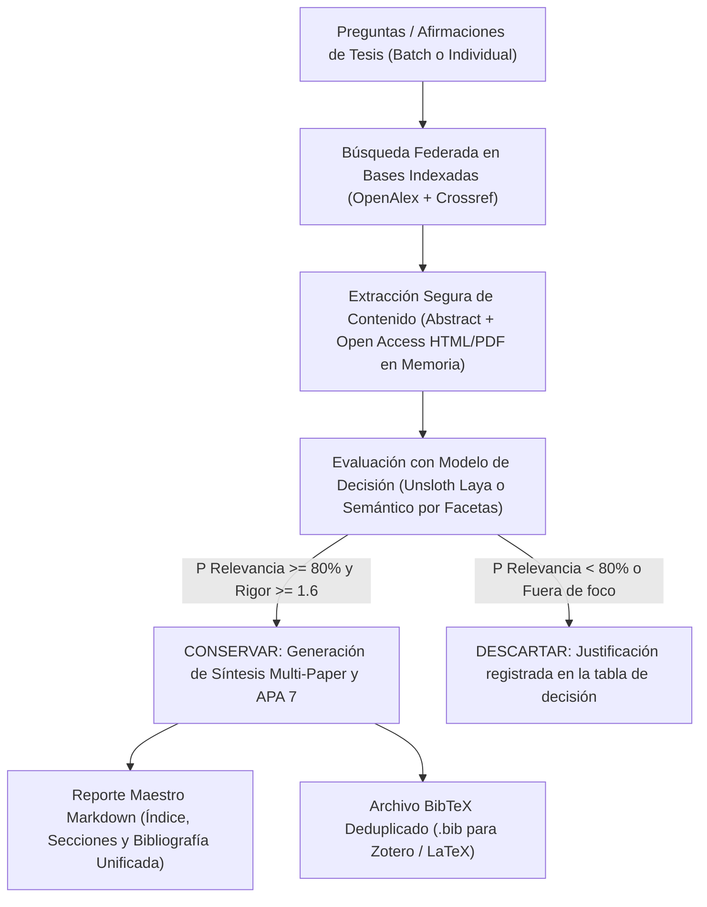

# 🎓 Thesis Consensus: Buscador y Evaluador Científico para Fundamentos Teóricos de Tesis

**Thesis Consensus** es un sistema automatizado en Python diseñado específicamente para tesistas de pregrado y posgrado. Su propósito es **fundamentar con rigor científico afirmaciones y preguntas de investigación**, contrastando la literatura mediante **modelos de decisión (Unsloth Laya / Jev API / Evaluador por Facetas)**, aplicando un **umbral exigente (80% - 85%)** y redactando automáticamente párrafos de marco teórico y bibliografía bajo las normas oficiales **APA 7ma Edición**.

Inspirado en plataformas como *Consensus.app*, pero adaptado a la elaboración sistemática del marco teórico y fundamentación teórica de una tesis universitaria.

---

## 📑 Tabla de Contenidos

- [1. Arquitectura y Flujo de Trabajo](#1-arquitectura-y-flujo-de-trabajo)
- [2. ¿Qué se le envía al Modelo de Decisión? (Resumen vs. Contenido Completo)](#2-qué-se-le-envía-al-modelo-de-decisión-resumen-vs-contenido-completo)
- [3. Mecanismos de Validación y Toma de Decisiones](#3-mecanismos-de-validación-y-toma-de-decisiones)
- [4. Seguridad y Cero Riesgo de Malware](#4-seguridad-y-cero-riesgo-de-malware)
- [5. Auditoría Científica, Cero Alucinación y Estándar APA 7ma Edición](#5-auditoría-científica-cero-alucinación-y-estándar-apa-7ma-edición)
- [6. evidencia.json: API Estructurada para Agentes Redactores](#6-evidenciajson-api-estructurada-para-agentes-redactores)
- [7. Configuración Centralizada (constants.py)](#7-configuración-centralizada-constantspy)
- [8. Modos de Uso y Ejecución por Lote (Batch)](#8-modos-de-uso-y-ejecución-por-lote-batch)
- [9. Organización Estructurada de Salidas (outputs/)](#9-organización-estructurada-de-salidas-outputs)
- [10. Tipado Estricto (Cero Any) y Pruebas Unitarias](#10-tipado-estricto-cero-any-y-pruebas-unitarias)

---

## 1. Arquitectura y Flujo de Trabajo

El sistema opera bajo un pipeline secuencial de 5 fases para garantizar que ningún texto quede sin sustento científico:



---

## 2. ¿Qué se le envía al Modelo de Decisión? (Resumen vs. Contenido Completo)

Una duda fundamental en la investigación asistida por IA es: **¿Es suficiente evaluar el resumen o se debe enviar el contenido completo del artículo (HTML / PDF)?**

### La Realidad Técnica y los Desafíos del Contenido Completo:
1. **Límite de Contexto de los Modelos de Decisión:**
   - Modelos especializados como **Unsloth Laya** tienen una ventana de contexto de **1024 tokens** (en modo multilingüe) o **512 tokens** (en inglés).
   - Un paper científico completo promedio tiene entre **10,000 y 25,000 palabras** (15 a 30 páginas). Si se intenta enviar un PDF completo de golpe, la ventana de contexto se satura de inmediato, provocando errores de memoria o truncando el 95% del documento (dejando únicamente la introducción genérica).
2. **Paywalls y Bloqueos de Editoriales:**
   - Más del 50% de los DOIs en editoriales académicas (IEEE, Springer, Elsevier, Taylor & Francis) tienen muros de pago (*paywalls*). La URL del DOI conduce a una página resumen y bloquea la descarga del texto completo con errores `403 Forbidden` a menos que se cuente con suscripción institucional.
   - Sin embargo, los **metadatos y resúmenes estructurados** están indexados legal y abiertamente a través de OpenAlex y Crossref.

### La Solución Implementada: Extracción Progresiva en 2 Fases (`SafeContentExtractor`)
El sistema no se limita a un simple resumen, sino que implementa una arquitectura progresiva inteligente:

1. **Fase 1: Cribado Rápido (Screening):**
   - Se analizan el título, palabras clave y el resumen estructurado reconstruido en memoria desde OpenAlex. Los artículos totalmente irrelevantes (p. ej. papers de medicina o física cuántica que aparecieron por homonimia de palabras) se descartan en milisegundos sin consumir ancho de banda.
2. **Fase 2: Extracción Profunda de Secciones Críticas (Deep Extraction):**
   - Para artículos que son de **Acceso Abierto (Open Access)**, el módulo `SafeContentExtractor` resuelve la URL oficial y extrae el texto enriquecido:
     - **Si es HTML Open Access:** Limpia etiquetas, scripts y rastreadores, extrayendo los párrafos centrales.
     - **Si es PDF Open Access:** Lee el archivo directamente en memoria (mediante `pypdf`), sin guardar nada en disco.
   - **Priorización de Secciones de Evidencia:** En lugar de saturar el modelo con párrafos de agradecimientos o fórmulas matemáticas irrelevantes, el algoritmo localiza y extrae las secciones de **Resultados (Results/Findings)**, **Discusión** y **Conclusiones**, seleccionando las mejores 500–650 palabras.
   - **Entrada al Modelo:** Se envía al modelo de decisión una estructura limpia que incluye:
     ```
     Paper Title: [Título]
     Venue/Journal: [Revista arbitrada o Congreso]
     Year: [Año]
     Content Source: open_access_pdf | open_access_html | abstract_only
     Content/Findings Excerpt:
     [Párrafos con resultados empíricos, porcentajes, métricas de tickets o conclusiones teóricas]
     ```

---

## 3. Mecanismos de Validación y Toma de Decisiones

El sistema valida la idoneidad teórica de cada artículo mediante dos motores complementarios:

### A. Integración con Unsloth Laya (Jev Decision API)
Si tienes **Unsloth Desktop** instalado y activo en `http://localhost:8888/v1/systemone`, el sistema le formula 3 preguntas estructuradas:
1. **`is_relevant` (`noul`):** Calibra la probabilidad matemática de que el paper fundamente directamente la afirmación de tesis.
2. **`evidence_type` (`choice`):** Clasifica el paper en:
   - `case_study`: Estudio de caso en instituciones educativas o help desks reales.
   - `survey_or_data`: Encuesta estadística, análisis de métricas de tickets o cuellos de botella.
   - `theoretical`: Marco conceptual, mejores prácticas ITIL/ITSM o revisión de literatura.
   - `irrelevant`: Descarte por no pertenecer al dominio.
3. **`rigor_score` (`score`):** Calibra la calidad y solidez académica en una escala de 0.0 a 3.0.

### B. Evaluador Semántico por Facetas Conceptuales (Zero-GPU Fallback)
Si Unsloth no está activo en ese instante, entra en acción el motor heurístico por facetas conceptuales, el cual evalúa si el artículo cubre los 3 pilares indispensables de tu tesis:
1. **Faceta 1 (Marco metodológico):** Presencia de ITSM, ITIL, gestión de servicios o gobernanza tecnológica.
2. **Faceta 2 (Contexto institucional):** Presencia de educación superior, universidades, facultades o campus académico.
3. **Faceta 3 (Problema operativo):** Presencia de mesa de ayuda (help desk), volumen de tickets, cuellos de botella o acuerdos de nivel de servicio (SLAs).

### C. Umbral Estricto de Corte (80% - 85%)
- **Regla:** Solo se conserva un artículo si su probabilidad calculada es **mayor o igual al 80% (o al 85% en modo estricto)** y su tipología no es irrelevante.
- Si un artículo habla solo de educación sin TI, o habla de ITIL en la banca sin tocar universidades, su puntaje no alcanza el 80% y se descarta automáticamente.

### D. Glosario de Etiquetas y Tipologías en los Reportes

En los reportes Markdown generados (`outputs/fundamentos_teoricos_tesis.md`), cada paper analizado incluye metadatos de auditoría para garantizar transparencia científica:

#### 1. Motores de Decisión (`Motor de Decisión`)
- **`heuristic_academic` (Evaluador Semántico de Facetas Académicas):** Algoritmo determinístico calibrado que analiza la presencia y congruencia de los 3 pilares conceptuales de la tesis (marco metodológico, contexto universitario y problemática operativa). Se activa como motor por defecto para garantizar funcionamiento 100% autónomo y rápido sin depender de servicios externos o GPUs pesadas.
- **`unsloth_laya` (Modelo de Decisión Neuronal Unsloth Laya / Jev API):** Modelo de lenguaje especializado en toma de decisiones probabilísticas ejecutado localmente vía Unsloth Desktop (`POST /v1/systemone`).
- **`openai_compatible` (Modelo LLM Generativo):** Evaluación asistida por modelos como GPT-4o o modelos locales mediante Ollama / vLLM.

#### 2. Tipologías de Evidencia (`Tipo de Evidencia / Tipología`)
- **`theoretical` (Marco Teórico / Conceptual):** Artículos dedicados a fundamentos teóricos, normas formales, principios de marcos de trabajo (ITIL v3/4, COBIT, ISO/IEC 20000) o revisiones sistemáticas de literatura. Indispensables para definir conceptos clave en la tesis.
- **`case_study` (Estudio de Caso Real):** Investigaciones que documentan la aplicación práctica de ITSM, Help Desk o gestión de incidentes en universidades, facultades o centros educativos específicos. Aportan evidencia empírica directa de campo.
- **`survey_or_data` (Estudio Cuantitativo / Métricas):** Artículos basados en encuestas estadísticas, análisis cuantitativo de volúmenes de tickets, cuellos de botella, tiempos de respuesta (MTTR) o acuerdos de nivel de servicio (SLA).
- **`irrelevant` (No Relevante):** Documentos descartados por pertenecer a otros dominios o no aportar a las preguntas de investigación.

---

## 4. Seguridad y Cero Riesgo de Malware

Descargar y ejecutar archivos PDF arbitrarios de internet representa vectores de ataque conocidos (exploits de Adobe/PDF, macros incrustadas o scripts maliciosos). Thesis Consensus garantiza **100% de inmunidad**:

1. **Sin Almacenamiento en Disco de Binarios:** No se crea ningún archivo binario ejecutable ni archivo `.pdf` temporal en tu sistema de archivos.
2. **Procesamiento Estrictamente en Memoria:** Las solicitudes a PDFs abiertos se descargan como un flujo de bytes en `io.BytesIO` y son leídas por el analizador en memoria `pypdf`, el cual solo extrae cadenas de texto plano UTF-8 y descarta por diseño scripts, formularios y acciones automáticas.
3. **Sanitización HTML:** Al procesar páginas web, se eliminan todas las etiquetas `<script>`, `<style>`, `<iframe>` y manejadores de eventos JavaScript.
4. **Bases Indexadas Confiables:** Las fuentes provienen exclusivamente de las APIs académicas oficiales (OpenAlex y Crossref).

---

## 5. Auditoría Científica, Cero Alucinación y Estándar APA 7ma Edición

A diferencia de los asistentes que generan párrafos sintetizados o paráfrasis automáticas (propensas a mezclar idiomas o alucinar afirmaciones), **Thesis Consensus** opera como un **motor de recuperación, evaluación probabilística y auditoría científica estricta**:

- **Cero Texto Sintético:** No genera párrafos simulados. Su objetivo es proporcionar datos científicos 100% verificables, citas exactas y cálculos de afinidad para que tú o un agente redactor independiente redacte el marco teórico a su manera.
- **Auditoría Textual Literal:** Para cada artículo aprobado, extrae la **cita textual literal en inglés** (`cita_textual_literal`) directamente de la sección de resultados del PDF o del abstract oficial, indicando su procedencia exacta (`ubicacion_fuente`).
- **Citación APA 7ma Edición Automatizada:** Genera de forma matemática las citas narrativas (p. ej. `Sarwar et al. (2023)`), las citas parentéticas (p. ej. `(Sarwar et al., 2023)`), la entrada BibTeX y la referencia bibliográfica completa en sentence case.

---

## 6. `evidencia.json`: API Estructurada para Agentes Redactores

Cada carpeta temática incluye un archivo `evidencia.json` diseñado específicamente para que puedas dárselo a un agente LLM de redacción (ChatGPT, Claude, Antigravity, etc.) con una instrucción como:

> *"Basándote en este archivo `evidencia.json`, redacta la sección de fundamentos teóricos sobre [Tema]. Utiliza las citas narrativas y parentéticas en formato APA 7 indicadas en `citacion_apa7` y fundamenta cada afirmación con la `cita_textual_literal` y el `contenido_sustantivo_extracto`."*

### Estructura de `evidencia.json`:
```json
{
  "tema_investigacion": "How is IT Service Management (ITSM) or ITIL implemented in higher education...",
  "resumen_evaluacion": {
    "total_candidatos_evaluados": 8,
    "papers_aprobados_conservados": 5,
    "papers_descartados": 3,
    "umbral_minimo_exigido": 0.8
  },
  "evidencias_conservadas": [
    {
      "titulo": "Digital Transformation of Public Sector Governance With IT Service Management–A Pilot Study",
      "primer_autor": "Sarwar",
      "año": 2023,
      "doi": "https://doi.org/10.1109/access.2023.3237550",
      "tipo_acceso": "open_access_pdf",
      "citacion_apa7": {
        "cita_narrativa": "Sarwar et al. (2023)",
        "cita_parentetica": "(Sarwar et al., 2023)",
        "referencia_completa": "Sarwar, M. I., ... (2023). ... IEEE Access, 11, 6490–6512.",
        "bibtex": "@article{sarwar_2023_digital, ...}"
      },
      "evaluacion_decision": {
        "motor_decision": "unsloth_laya",
        "probabilidad_relevancia": 0.916,
        "tipo_evidencia": "theoretical",
        "rigor_metodologico": 1.78,
        "justificacion_decision": "Decisión Laya: P(relevancia)=91.6% (Umbral: 80%). Aceptado con alta afinidad"
      },
      "cita_textual_literal": "A well-implemented ITSM delivery system improves the quality of IT services...",
      "ubicacion_fuente": "Sección de Resultados / Hallazgos del Artículo Completo (Open Access PDF)",
      "contenido_sustantivo_extracto": "Information Technology or IT is a combination of technology itself..."
    }
  ],
  "papers_descartados": [
    {
      "titulo": "Governance Mechanisms in Higher Education",
      "motivo": "No superó el umbral mínimo exigido (80% - 85%)"
    }
  ]
}
```

---

## 7. Configuración Centralizada (`constants.py`)

Todas las opciones globales se configuran en [`thesis_consensus/constants.py`](file:///Users/jhan/Documents/Proyectos/codigo_para_buscar_papers_sobre_tema_en_especifico/thesis_consensus/constants.py):

| Variable | Valor por Defecto | Propósito |
| :--- | :--- | :--- |
| `DEFAULT_DECISION_ENGINE` | `"unsloth_laya"` | Motor de decisión predeterminado (Unsloth Desktop GPU) |
| `DEFAULT_LANGUAGE` | `"es"` | Idioma para citas y etiquetas APA 7 |
| `DEFAULT_RELEVANCE_THRESHOLD` | `0.80` (80%) | Umbral de aprobación estándar del modelo de decisión |
| `STRICT_RELEVANCE_THRESHOLD` | `0.85` (85%) | Umbral estricto para máxima rigurosidad |
| `MINIMUM_RIGOR_SCORE` | `1.6 / 3.0` | Calidad metodológica mínima exigida |
| `UNSLOTH_DEFAULT_URL` | `http://localhost:8888/v1/systemone` | Endpoint del modelo de decisión Laya en GPU |
| `DEFAULT_MIN_PUBLICATION_YEAR`| `2015` | Garantiza literatura actualizada de los últimos años |
| `DEFAULT_SEARCH_LIMIT` | `15` | Cantidad de papers candidatos a explorar por tema |

### Autenticación Local Segura (`.env`)
Unsloth Desktop protege su API local con un Bearer token.
Crea tu archivo `.env` en la raíz (está incluido en `.gitignore` para no subirse a GitHub):
```bash
UNSLOTH_API_KEY=sk-unsloth-tu_clave_aqui
UNSLOTH_URL=http://localhost:8888/v1/systemone
```

---

## 8. Modos de Uso y Ejecución por Lote (Batch)

### A. Evaluar Múltiples Preguntas de Tesis en un Solo Comando (Motor Laya por Defecto)
```bash
python main.py --topic \
  "How is IT Service Management (ITSM) or ITIL implemented in higher education institutions and university help desks?" \
  "What are the challenges, ticket volume overloads, and bottlenecks in university IT support and help desk services?" \
  --threshold 0.80
```

### B. Cargar Preguntas desde un Archivo (`preguntas.txt`)
Crea un archivo de texto con una pregunta por línea:
```text
How is IT Service Management (ITSM) or ITIL implemented in higher education institutions?
What are the challenges and bottlenecks in university IT support and help desk services?
Impact of ITIL incident management and service level agreements (SLAs) on user satisfaction
```
Y ejecútalo con:
```bash
python main.py --file preguntas.txt --threshold 0.85
```

### C. Menú Visual Interactivo
```bash
python main.py --interactive
```

---

## 9. Organización Estructurada de Salidas (`outputs/`)

Para evitar cualquier desorden al formular múltiples preguntas de tesis en lote, los resultados se organizan **estrictamente en subcarpetas temáticas limpias** dentro de `outputs/`, sin carpetas consolidadas redundantes ni archivos sueltos:

```
outputs/
├── tema_how-is-it-service-management-itsm-or-itil-imp/
│   ├── fundamentos_teoricos.md   # Reporte Markdown con tablas de decisión y evidencias auditadas
│   ├── referencias.bib          # Bibliografía BibTeX deduplicada del tema
│   └── evidencia.json           # JSON estructurado para el agente redactor de la tesis
│
└── tema_what-are-the-challenges-ticket-volume-overloa/
    ├── fundamentos_teoricos.md   # Reporte Markdown con tablas de decisión y evidencias auditadas
    ├── referencias.bib          # Bibliografía BibTeX deduplicada del tema
    └── evidencia.json           # JSON estructurado para el agente redactor de la tesis
```

---

## 10. Tipado Estricto (Cero Any) y Pruebas Unitarias

El código fue diseñado bajo las mejores prácticas de ingeniería de software en Python:
- **Cero uso de `Any`:** Cada estructura, diccionario y parámetro posee tipos concretos (`str`, `int`, `float`, `Author`, `PaperMetadata`, `DecisionEvaluation`, etc.).
- **Validación con Mypy:**
  ```bash
  mypy thesis_consensus tests
  # Resultado: Success: no issues found in 20 source files
  ```
- **Pruebas Unitarias Automatizadas:**
  ```bash
  python -m unittest discover tests
  # Resultado: Ran 9 tests in 0.046s - OK
  ```
